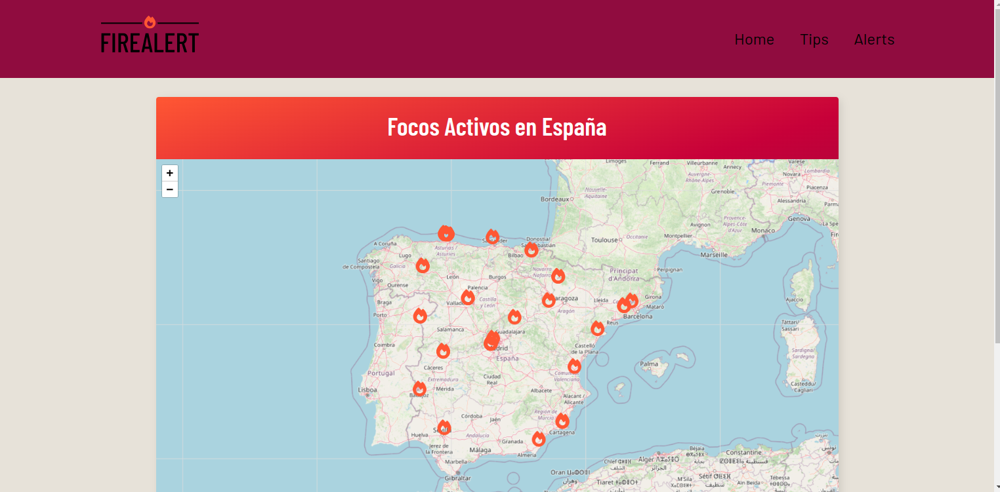
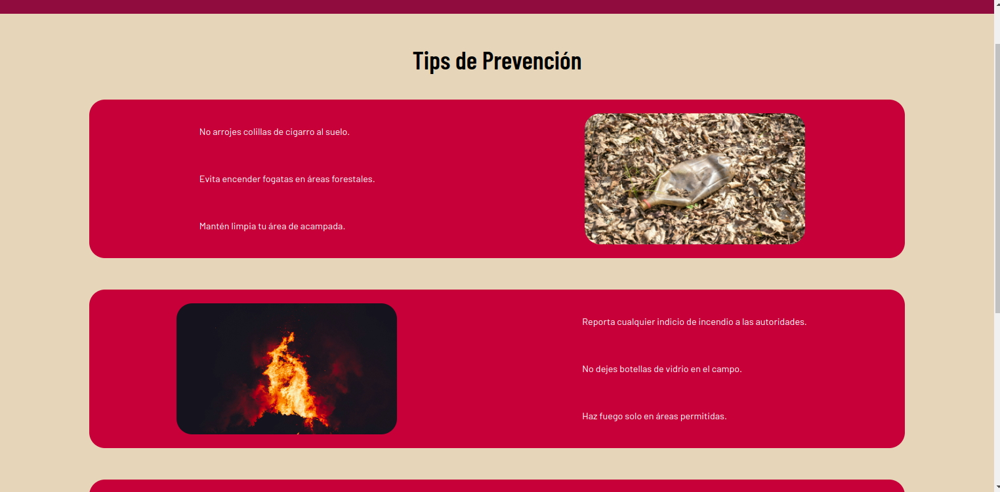
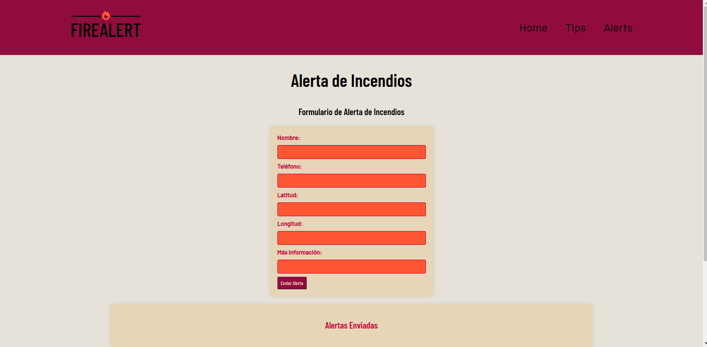

# Proyecto FireAlert

## Descripción del Proyecto

Este proyecto es una herramienta de monitorización de incendios en tiempo real para la península ibérica. Utilizamos React y JavaScript para el frontend y C# para el backend. La información de incendios se obtiene de la API de la NASA [FIRMS](https://firms.modaps.eosdis.nasa.gov/api/). Además, los usuarios pueden reportar nuevos incendios a través de un formulario y verlos en el mapa interactivo.

## Características

- **Monitorización en tiempo real**: Obtén datos actualizados sobre incendios activos en la península ibérica.
- **Mapa interactivo**: Visualiza los incendios en un mapa con información detallada.
- **Reportar incendios**: Los usuarios pueden rellenar un formulario para reportar nuevos incendios, que se agregarán al mapa.
- **Backend robusto**: Gestión de datos y lógica del lado del servidor implementados en C#.

## Tecnologías Utilizadas

- **Frontend**:
  - React
  - JavaScript
  - CSS
- **Backend**:
  - C#
  - ASP.NET Core
- **API**:
  - [NASA FIRMS](https://firms.modaps.eosdis.nasa.gov/api/)

## Instalación

### Requisitos previos

- Node.js
- .NET Core SDK

### Clonar los repositorios
Para el repositorio del Frontend, navegar hasta la carpeta donde se quiera clonar el proyecto y ejecutar el siguiente comando:
```bash
git clone https://github.com/Marclosk/https-github.com-Marclosk-Frontend-Incendios-Mundiales
```
Para el del Backend, hacer lo mismo ejecutando el siguiente comando:
```bash
git clone https://github.com/alexmrtc/FireAlert
```

### Instalaciones del Frontend

Navegar a la carpeta del Frontend y ejecutar el siguiente comando:
```bash
npm install
```
Una vez este todo instalado, podemos ejecutar la aplicación con:
```bash
npm run start
```

### Instalaciones del Backend

Navegar a la carpeta del Backend y ejecutar lo siguiente:
```bash
dotnet restore
```
Y seguidamente para iniciar la aplicación:
```bash
dotnet run
```

## Uso
Abre tu navegador y navega a [http://localhost:4000](http://localhost:4000) para acceder a la interfaz de usuario.
Utiliza el mapa para ver incendios activos en tiempo real.
Rellena el formulario para reportar un nuevo incendio y verlo en el mapa.

## Aspecto de la aplicación
Nada mas abrir la aplicación, podemos encontrar este Layout donde podemos observar un mapa de la peninsula con los diferentes incendios activos a tiempo real:


Una vez en el menú, si visitamos el apartado de Tips encontraremos una serie de consejos a seguir para evitar los incendios y como actuar en caso de encontrar alguno:


A su vez, podemos encontrar un apartado de alertas que nos servirá para reportar como usuarios algun incendio que hayamos podido avistar en unas coordenadas concretas. Simplemente hace falta rellenar el formulario y la alerta de incendio aparecerá en el mapa. También hay un menú que muestra las alertas enviadas y que nos permite eliminarlas o modificarlas:


## Contribuciones
¡Las contribuciones son bienvenidas! Si deseas contribuir, sigue estos pasos:

    1. Haz un fork del repositorio.
    2. Crea una nueva rama (`git checkout -b feature/nueva-caracteristica`).
    3. Realiza tus cambios y haz un commit (`git commit -m 'Añadir nueva característica'`).
    4. Haz push a la rama (`git push origin feature/nueva-caracteristica`).
    5. Abre un Pull Request.

## Licencia
Este proyecto no está bajo ninguna licencia. 

## Agradecimientos
A la NASA por proporcionar la API FIRMS para la monitorización de incendios.
A todos los colaboradores y contribuyentes de este proyecto.

